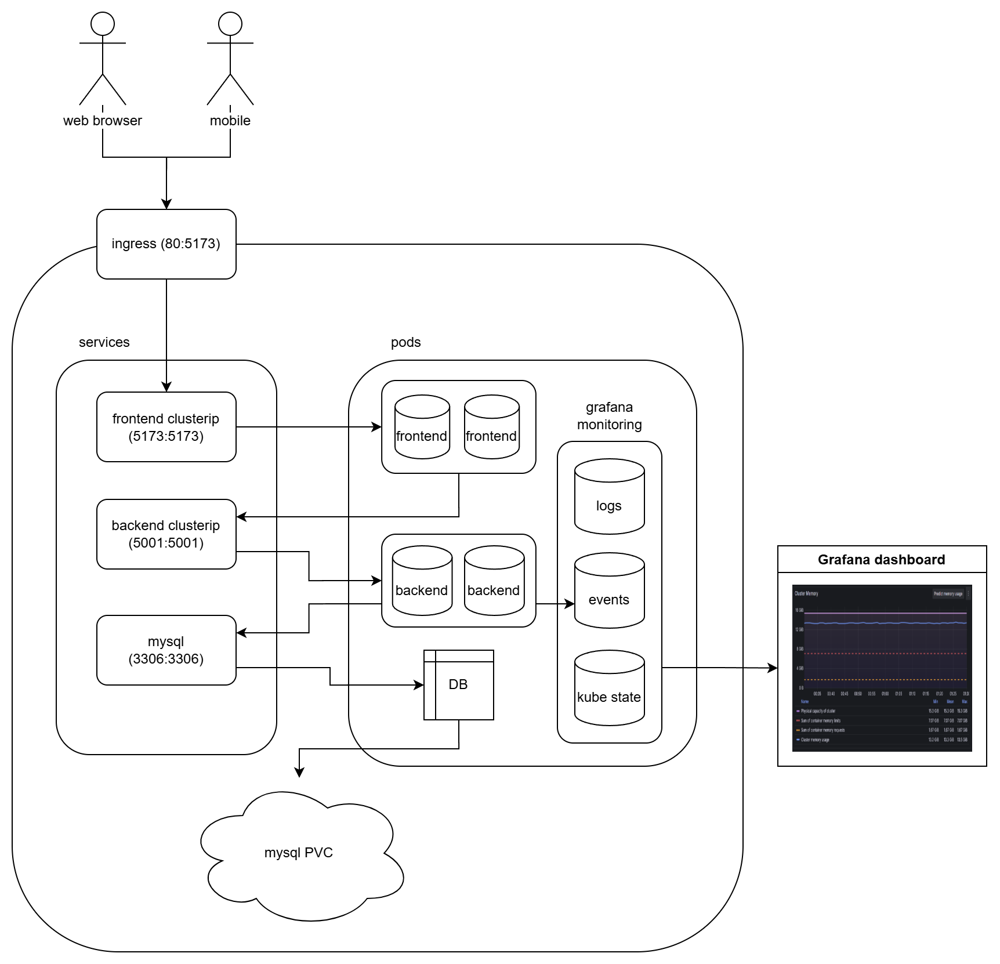

# Lab Requirements Management

### Group 15 

#### Members:

| Name    | ID        | Role            |
|---------|-----------|-----------------|
| 彭暄宇   | 312551032| 前端UI設計和實作  |
| 李亭萱   | 312551099| 前端UI設計和實作  |
| 蔡佩君   | 312551043| 後端和資料庫實作  |
| 翁堉豪   | 312551076| 功能統整、測試    |
| 林佑庭   | 312551098| 系統部署和監控實作 |

### User story: 

#### 1. 晶圓品質管理工程師

為每個委託單指定特定的實驗室，並能選擇緊急性和附上相關附件，確保需求內容能夠完整且清晰地傳遞給實驗室。

能即時獲得每個委託單的處理狀態和歷史紀錄，也需要能夠動態調整委託單的優先順序，以便於更有效地進行需求追蹤和管理。

#### Goal:

* 創建委託單功能
* 提供實驗室選項
* 緊急性選項
* 提供上傳附件功能
* 顯示委託單處理狀態和歷史紀錄
* 提供修改緊急性功能
* 控制使用者修改權限

#### 2. 分析實驗室工程師

將委託單區分為一般、急單、特急單，進入平台後可以直接看到根據優先順序排列的需求單，以便於優先處理。

能即時收到新的委託單核准通知，以便於及時安排和分配資源。

完成或拒絕委託單，以便有效管理工作流程並記錄處理結果。

#### Goal:

* 根據緊急程度排列/篩選委託單
* 即時發送郵件通知核准者
* 使用者完成與拒絕功能
* 更新委託單狀態
* 權限控管

### Sysem Architecture

* Frontend: Vue.js + nodejs
* Backend: Flask
* Database: mysql
* Mail notification: google smtp
* Monitoring: Grafana

### Monitoring

利用Grafana來監控k8s cluster中的:

* 網站資料請求
* 請求錯誤
* Dashboard觀看次數
* CPU Usage
* MEM Usage
* Cluster logs

用來評估運算資源的使用，以及監控應用運作的穩定性。

> https://eusden.grafana.net/  (需要登入)

### DEMO website

http://34.72.214.80/

> Version: 1.0.0

